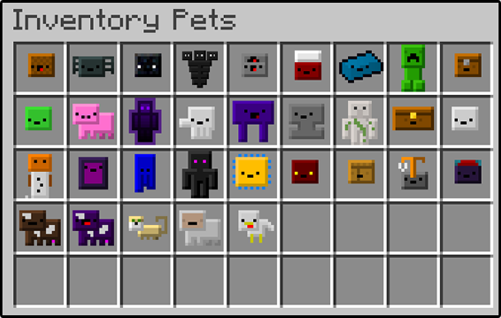
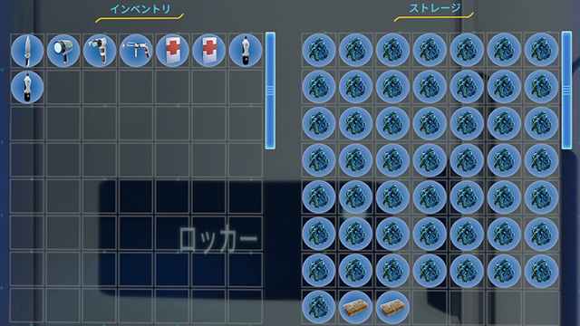
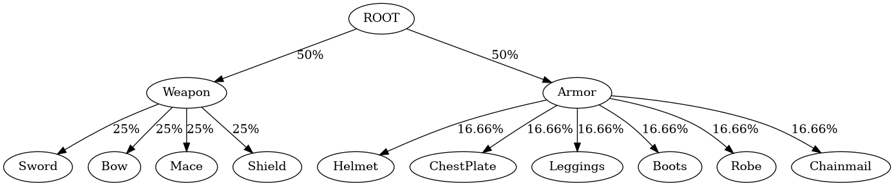
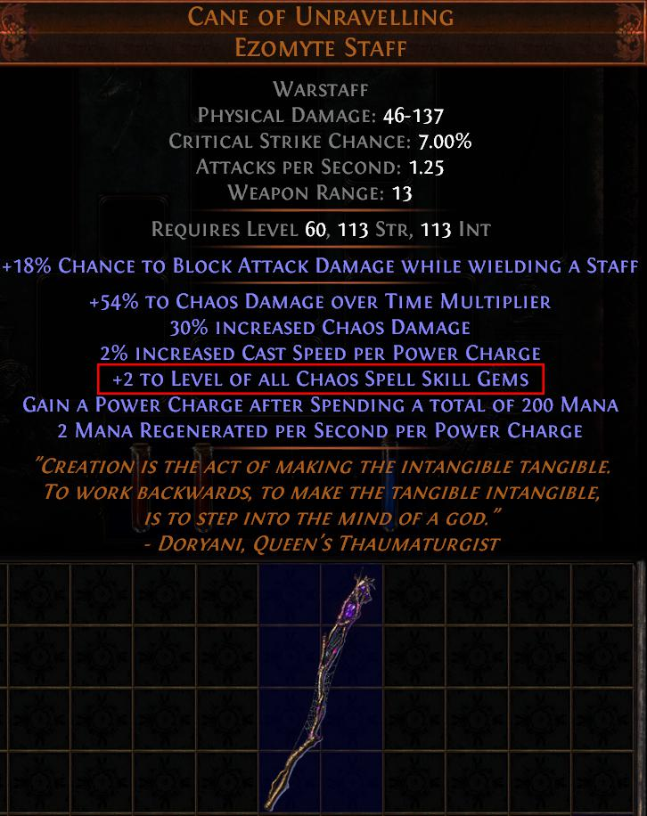
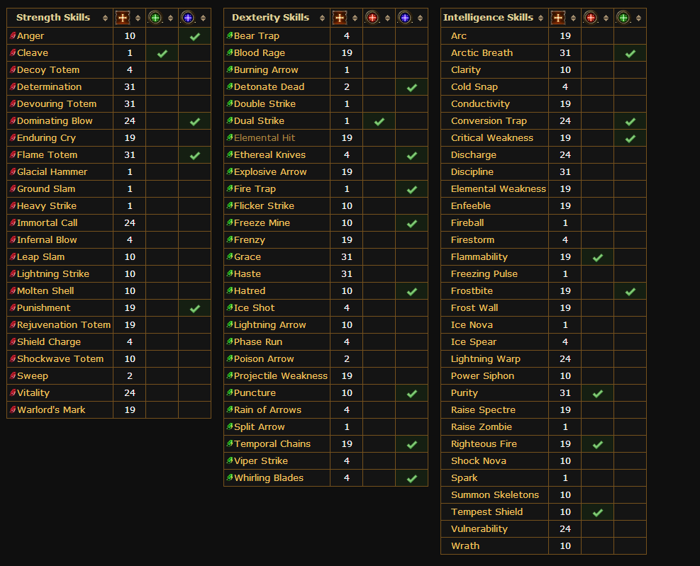
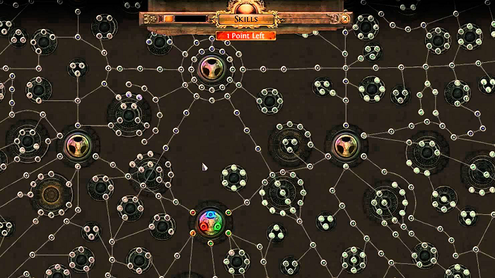

[![Crates.io][s1]][ci] [![docs page][docs-badge]][docs]

[s1]: https://img.shields.io/crates/v/game_features.svg
[ci]: https://crates.io/crates/game_features
[docs-badge]: https://img.shields.io/badge/docs-website-blue.svg
[docs]: https://docs.rs/game_features

Support an Open Source Developer! :hearts:  

[](https://www.patreon.com/jojolepro)


The goal of the library is to share common game features between developers.

# Open Source Game Features

Are you tired of games keeping their features for themselves?

Wouldn't it be great if we could share the general features that are really common and spend the time we would save making awesome games?

No one wants to spend 30 hours programming an inventory system that is (almost) the same as those currently released in closed source games.

Its time we change this!

By making as many of the general game features as possible open source, the game developement community will finally be able to focus on what really matters: Making their game unique and enjoyable! 

This library aims to do just that. It is a repository where we will share and develop together those reusable game pieces.

## Features

### Implemented
The following images come from games used as inspiration for those features and
show how they can be used in various games.

#### Extensible and Fully-Featured Inventory System

An item and inventory system that supports both statically sized and dynamically
sized inventories.



#### Simple Loot Trees



#### Stats and Stats Modifiers



#### Active and Passive Skills



#### Unlockable Trees



#### Planned

* Player Authentication
* User Management (kick, ban, mute, etc)
* User Permissions
* Group Based Chat Formatting and Scopes
* World ownership and protection systems
* Faction-based claiming systems.

## Principles

We aim to be data-oriented to facilitate the integration in whichever workflow you have.

Everything here is composed of serializable data and generics. We are not constraining you to a specific way of handling changes in the data.

Integrating those game features is easy:
* Take the events coming from your game engine or game logic
* Use them on one or many of the features from this repository
* Notice the changes in the data
* Give feedback to your user/player

Its that simple!

Even better, since all data is meant to be serialized, and is created by composing structures together, you can easily:
* Save the game state
* Store it in a relational database (or any file, really)
* Load it into a running game
* Inspect it
* Debug changes
* Painlessly refactor


#### Stats? Items? Skills? What are those?


## Contributing

I highly encourage contributing to this library. All of the game developement community will be able to benefit from it.
And when they benefit, you benefit too via the increased amount of visibility of the library, which means more developement effort and more features!

If you cannot or don't want to contribute code, you can still help!
All money that goes into my [Patreon](https://www.patreon.com/jojolepro) is a huge help and allows me to spend more time working on this project.

## Compatibility

I am currently looking into FFI bindings compatibility.
If the library is compatible (which it should), that means that it will be usable in any language that can bind to a C API.
Yes, that means you will be able to use this library in your c, c++, c# projects, making this library compatible with the following engines:
* Source
* Unity
* Unreal
* Cry Engine
* Amethyst Engine
* Piston
* ggez
* Any engine that can load a c static library in any way (.dll, .so).

## Usage

Add this line to your Cargo.toml file:
```
game_features = "*"
```

For more information on each feature, see the docs badge at the top of this page.
Alternatively, for usage examples, there are unit tests at the bottom of each file (except lib.rs) in the src/ directory which are good examples.

Good luck! Feel free to ask any questions you may have.

## Contact

When possible, report issues through Github's issues page.

